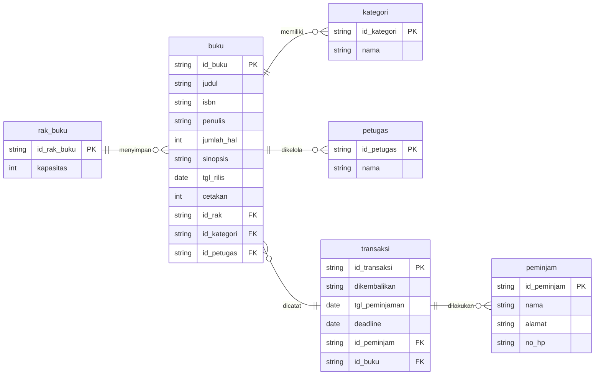

# ERD Perpustakaan

Minitask Database - ERD. This erd is related to library borrowing with the entities of book, category, bookshelf, borrower, officer and transaction.

```mermaid
erDiagram
    direction LR
    rak_buku ||--o{ buku  : menyimpan
    rak_buku {
        string id_rak_buku PK
        int kapasitas
    }
    buku ||--o{ kategori : memiliki
    buku ||--o{ petugas : dikelola
    buku }o--|| transaksi : dicatat
    buku {
        string id_buku PK
        string judul
        string isbn
        string penulis
        int jumlah_hal
        string sinopsis
        date tgl_rilis
        int cetakan
        string id_rak FK
        string id_kategori FK
        string id_petugas FK
    }
    kategori {
        string id_kategori PK
        string nama
    }

    petugas {
        string id_petugas PK
        string nama
    }
    peminjam {
        string id_peminjam PK
        string nama
        string alamat
        string no_hp
    }
    transaksi ||--o{ peminjam : dilakukan
    transaksi {
        string id_transaksi PK
        string dikembalikan
        date tgl_peminjaman
        date deadline
        string id_peminjam FK
        string id_buku FK
    }

```
