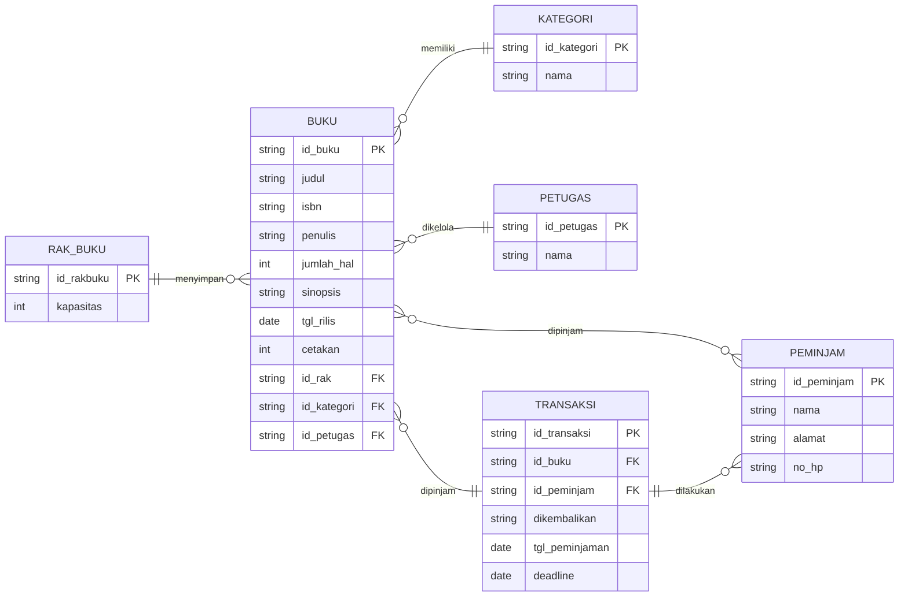

# ERD Perpustakaan

```mermaid
erDiagram
    direction LR
    RAK_BUKU ||--o{ BUKU  : menyimpan
    RAK_BUKU {
        string id_rakbuku PK
        int kapasitas
    }
    BUKU }o--|| KATEGORI : memiliki
    BUKU }o--|| PETUGAS : dikelola
    BUKU }o--o{ PEMINJAM : dipinjam
    BUKU }o--|| TRANSAKSI : dipinjam
    BUKU {
        string id_buku PK
        string judul
        string isbn
        string penulis
        int jumlah_hal
        string sinopsis
        date tgl_rilis
        int cetakan
        string id_rak FK
        string id_kategori FK
        string id_petugas FK
    }
    KATEGORI {
        string id_kategori PK
        string nama
    }

    PETUGAS {
        string id_petugas PK
        string nama
    }
    PEMINJAM {
        string id_peminjam PK
        string nama
        string alamat
        string no_hp
    }
    TRANSAKSI ||--o{ PEMINJAM : dilakukan
    TRANSAKSI {
        string id_transaksi PK
        string id_buku FK
        string id_peminjam FK
        string dikembalikan
        date tgl_peminjaman
        date deadline
    }

```
